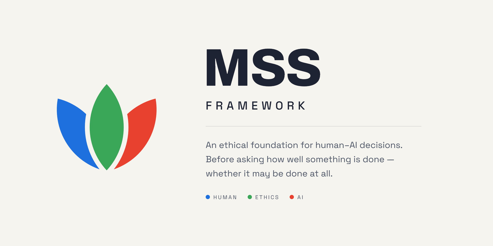

# Malek Symbiosis Standard

**The Symbiosis Standard.** Version 4.5.0. Author: Mateusz Małek.

Polish: [README.pl.md](README.pl.md) · Licensed CC BY-SA 4.0

---

## What this is

MSS is **a set of questions you ask yourself about a decision before you carry it out.**

Nothing more. There is no software here, no scoring, no certificate and no training course. There is a list of questions and a rule about what to do with the answers.

You can ask them alone. You can ask them together with an artificial intelligence — and that is where the system works best, because an AI asks the questions a person will not put to themselves.

**This is not legal advice and it does not replace a lawyer.**

---

## Where it came from

MSS was not written to be published. It was written as **one person's working tool** — somebody working with an artificial intelligence who noticed in themselves the same problem most people notice after a few months of that kind of work:

**An AI does what you ask it to.** It does it fast, it does it well, and it does not ask awkward questions. And decisions that hurt somebody rarely look bad at the moment they are taken. They look sensible, profitable and urgent.

The first versions looked nothing like this one. There were scores, percentages, thresholds and weights. All of it was removed, because it did one bad thing: **it let you make up in one place what you had lost in another.** A decision with a low ethical score and a high business score came out positive overall. That is exactly the arithmetic this system is meant not to do.

What was left is what had to be left: **eight questions whose answer is "allowed" or "not allowed," and nothing in between.**

The name changed too. Earlier versions were called a "scoring system," after the scoring that no longer exists. Today's name says what it is actually about: **symbiosis** — that a human and an AI do together something neither would do alone, and that both sides answer to the same rules.

<!-- TO BE COMPLETED BY THE AUTHOR: if you want to describe the personal context this came out of — a particular situation, text or conversation that started it — this is the place for one paragraph. -->

It runs in production on the Fibid.pl, Frostbox.pl and AutoQuote.pl platforms, and across a number of business agents.

---

## What is here, and what is not

What you are reading is **the skeleton**: the rules and the procedure, and nothing else. The version that runs in our own applications is built on top of this skeleton.

That version is not here and will not be — but not because it is better. Because it is **a different thing**. It is the product layer: wiring to particular data, particular roles inside a company, particular tools, working templates for agents. Published, it would be useless to anybody but us, and it would expose things that belong to nobody but us.

**The skeleton is not a cut-down version.** The rules standing here are exactly the rules running in our work, word for word. There is no demo edition, no simplified edition and no weakened edition. What is missing is only what ties these rules to one particular product.

**For you that means this:** take the skeleton and build your own layer on it, the way we built ours. The rules are enough to start with today. The rest depends on what you work in.

---

## What it is for

**There is one goal: that a decision which hurts somebody does not pass unnoticed.**

Not "so that everybody is ethical." Not "so that AI is safe." Goals put that way cannot be checked, so they mean nothing.

MSS sets a goal that can be checked: **after a decision, a record is left from which somebody else can read who the decision touched, and whether that person had any say at all.**

Three things follow from that, and the system holds to all three:

**Name a person, not a group.** "This affects the market" names nobody. Until you write down who specifically loses, there is no way to see that anybody did.

**Check whether that person could have refused.** Not whether they formally had the right — almost everybody does. Only what it would have cost them.

**Write it down.** A conversation is gone by the evening. A record stays, and it can be read later — including against yourself.

---

## The three pillars

The name speaks of symbiosis, and symbiosis needs at least two sides. Here there are three.

### The human

**Has the answers.** They know what they want, what has already failed once, and who really stands on the other side. Nobody else knows that, and no tool will guess it.

### The AI

**Has the questions.** Not because it is cleverer — because it is not you. You are too close to your own decision to challenge it. That is not an accusation against you; it is a description of how every person defending something they thought of themselves behaves.

### Ethics

**Stands on neither of those two sides.** The eight principles that can stop a decision stand for the people that decision will touch — and those people are usually not in the room, and nobody asks them.

---

## How it works

The whole procedure is six steps, and each fits in one sentence.

| Step | The question |
|------|--------------|
| **1. Consequence** | Can this be undone? |
| **2. The framework gate** | Eight principles. Allowed or not allowed? |
| **3. Review** | Five questions about the quality of the decision. |
| **4. Flags** | What has to be closed, by whom, and by when? |
| **5. Verdict** | Proceed, proceed after closing flags, or do not proceed. |
| **6. Limits** | What did you not check? |

**First whether it is allowed. Then whether it is worth it. Last what you do not know.**

Two things that set this apart from an ordinary checklist:

**The gate is unconditional.** A closed gate is one you hold no key to: nothing reopens it — not a good justification, not good intentions, not the fact that you have done everything right so far. There is no balance sheet here on which something good offsets something bad.

**The last section can overturn the verdict at the top of the page.** You write into your own document what you did not check — and that can change a decision recorded three paragraphs above. Nobody does that with pleasure, which is why the section is compulsory.

---

## What the result looks like

On a reversible decision you get a short note and nothing more.

On an irreversible decision the record is longer — but **longer only because the consequence is heavier**.

Three full examples, with a line-by-line commentary, are in [examples/](examples/).

---

## Where everything is

| File | Who for | What is in it |
|------|---------|---------------|
| **[STANDARD.md](standard/STANDARD.md)** | implementers, and AI | **All the rules.** The full specification: consequence, the eight principles, review, flags, verdict, record. |
| [AGENT.md](standard/AGENT.md) | AI | When a model runs the assessment unprompted, and what to ask before it does. |
| [USE-WITH-CLAUDE.md](guides/USE-WITH-CLAUDE.md) | you, right now | How to get it running in a chat window. Two minutes. |
| [examples/](examples/) | anybody | Three full assessments with commentary. |
| [DIAGRAMS.md](guides/DIAGRAMS.md) | visual readers | Four diagrams of the procedure. |
| [NAME-USAGE.md](guides/NAME-USAGE.md) | implementers | When you may say "MSS-compliant". |
| [CONTRIBUTING.md](CONTRIBUTING.md) | contributors | What to send, and how. |

**You do not have to read all of it.** If you only want to see whether this works, go straight to [USE-WITH-CLAUDE.md](guides/USE-WITH-CLAUDE.md). If you want to know exactly what the rules say, go to [STANDARD.md](standard/STANDARD.md).

---

## Try it

Two minutes to get it running in a chat window: **[Using MSS with Claude](guides/USE-WITH-CLAUDE.md)**.

Then give it a decision of your own. Preferably one you are not sure about.

---

## What this does not solve

**Ethics cannot be closed inside rules.** That sentence is not modesty but a warning — and it stands in the standard itself.

The eight principles can be played with a clever justification. More easily still by stretching the classification of consequence, or by the name of the decision alone, because the name is one word and nobody checks it.

**MSS gives no guarantee. It gives this much: cheating is harder, and it is written down.**

If you find a decision that passes all eight principles and should not — **that is the most valuable thing anybody can send this project.** How to report it is in [CONTRIBUTING.md](CONTRIBUTING.md).

---

## Licence and name

**The text** is under [CC BY-SA 4.0](LICENSE.md): copy it, change it, use it commercially — as long as you credit the author and keep the same licence.

**The name** is a separate matter. "MSS-compliant" may only be said where all eight principles are implemented, without exceptions. Partial adoption is described as "based on MSS," saying which parts were left out — details in [NAME-USAGE.md](guides/NAME-USAGE.md).

Author: **Mateusz Małek**. Citation: [CITATION.cff](CITATION.cff). History of changes: [CHANGELOG.md](CHANGELOG.md).
