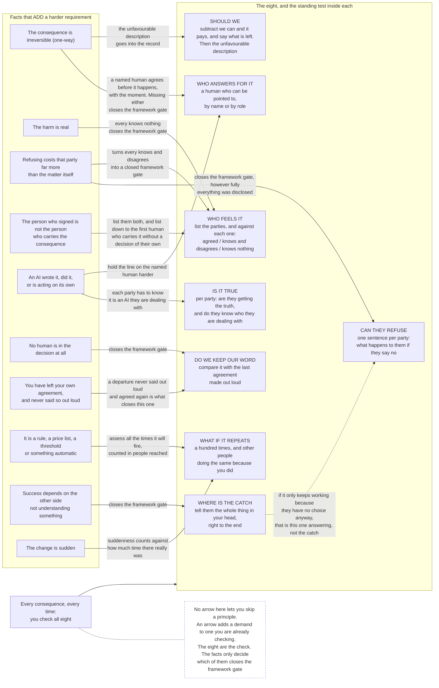
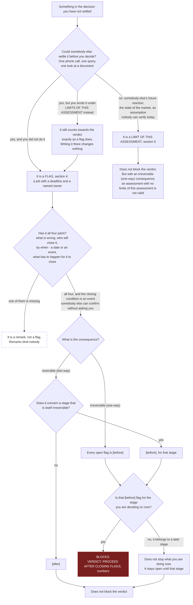
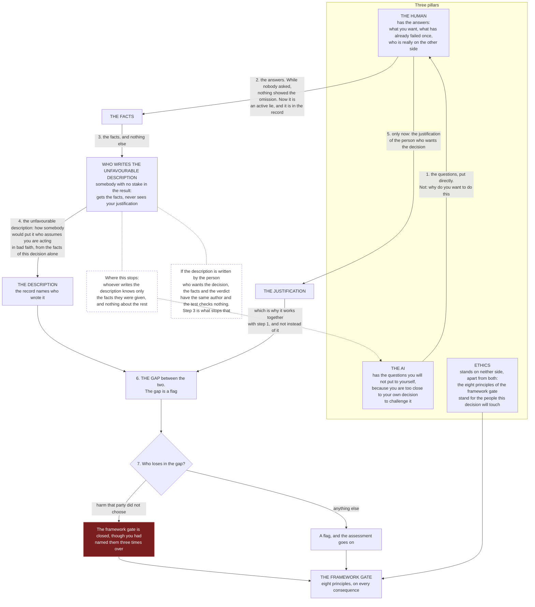

# MSS — Diagrams

**Version 4.5.0.** The standard: [STANDARD.md](../standard/STANDARD.md) · Polish: [STANDARD.pl.md](../standard/STANDARD.pl.md).

Four diagrams of the procedure the standard describes in words:

1. **The run of an assessment** — from the decision to the written record.
2. **The eight principles** — and what makes each of them close the gate.
3. **A flag or a limit** — which section something goes into.
4. **The three pillars** — who brings what, and in which order.

**The standard is the canon.** These diagrams are an aid to reading it. Wherever a diagram and the standard disagree, **the standard wins.**

They render natively on GitHub, and they are text — so you can version them and correct them like any other line of the standard.

---

## 1. The run of an assessment

From the decision to the written record.

The order is: CONSEQUENCE → FRAMEWORK GATE → REVIEW → FLAGS → WHEN YOU COME BACK → VERDICT → LIMITS OF THIS ASSESSMENT.

```mermaid
flowchart TD
    D["A decision you are about to act on"] --> SCOPE{"Does it touch somebody?<br/>Not a question of fact,<br/>not a move you can undo in one"}
    SCOPE -->|"no, and the consequence<br/>stays in this conversation"| OUT["Do not run MSS.<br/>Overdoing it is a mistake too"]
    SCOPE -->|"no, but the consequence leaves<br/>this conversation, section 1c"| TIME
    SCOPE -->|"yes"| TIME{"Section 1b. Is the delay itself<br/>the irreversible consequence?"}

    TIME -->|"yes"| ACT["Act now"]
    ACT --> LATE["Then write it up, within the day.<br/>The record has to name why there was no time.<br/>This is the only departure from the order"]
    LATE --> C1
    TIME -->|"no"| C1

    C1{"Section 1. Does any one of these four hold?<br/>1. it cannot be undone<br/>2. it costs a lot when it goes wrong<br/>3. it binds you to somebody outside the company<br/>4. it judges a person or damages a relationship<br/>in a way that person cannot refuse without a cost"}
    C1 -->|"none of the four"| TWO["Reversible (two-way) consequence"]
    C1 -->|"any one of them,<br/>or you are in doubt"| ONE["Irreversible (one-way) consequence"]

    NOTE0["Irreversible is the name of the whole class,<br/>not of condition 1 alone. It covers all four conditions,<br/>not only a technical undo, and one of them is enough.<br/>A binding offer you could technically withdraw<br/>is irreversible through condition 3"]
    C1 -.- NOTE0

    TWO --> C1C{"Section 1c. Any one of these four?<br/>1. it touches a third party and cannot be undone<br/>2. it repeats without you<br/>3. it runs without you<br/>4. somebody asked you to skip the check"}
    C1C -->|"none of the four"| SHORT["The short record is allowed"]
    C1C -->|"any one of them"| FULL["The full record is required"]
    ONE --> FULL

    SHORT --> GATE
    FULL --> GATE
    GATE{"Section 2. THE FRAMEWORK GATE.<br/>All eight principles, on every consequence.<br/>ALLOWED or NOT ALLOWED. There is no third option"}

    GATE -->|"NOT ALLOWED"| NA["Name the principle and the party it hits.<br/>Add what would have to change.<br/>Irreversible consequence: the unfavourable description<br/>and who wrote it"]
    NA --> STOP["VERDICT: DO NOT PROCEED"]
    STOP --> DEAD["Nothing turns a closed framework gate around.<br/>Not a good review, and not the fact<br/>that you have got everything right so far"]

    GATE -->|"ALLOWED"| GL["Write: checked all eight.<br/>Underneath, always: the closest principle,<br/>and a sentence about a named party.<br/>Irreversible consequence: the unfavourable description<br/>and who wrote it"]
    GL --> REV["Section 3. THE REVIEW, five questions.<br/>Irreversible consequence: Consequences is always required,<br/>with the cost of undoing and who carries it"]
    REV --> FL["Section 4. FLAGS. A flag is a job with a deadline<br/>and a named owner. Four parts each, numbered.<br/>The consequence sets the kind, you do not"]
    FL --> BACK["WHEN YOU COME BACK TO IT:<br/>what has to happen - how much of what, and by what date.<br/>Single step with nothing to come back for: the line drops out"]
    BACK --> V{"Section 4. THE VERDICT,<br/>read off three lines. Nowhere else"}

    V -->|"the framework gate says NOT ALLOWED - always,<br/>whatever the rest says"| STOP
    V -->|"an open [before] flag for this stage"| PAF["PROCEED AFTER CLOSING FLAGS, numbers.<br/>No reason written: it is already in the flag"]
    V -->|"everything else"| PROC["PROCEED, with a reason"]

    STOP --> LIM
    PAF --> LIM
    PROC --> LIM
    LIM["Section 5. LIMITS OF THIS ASSESSMENT, a required part.<br/>What you did not check, what you do not know,<br/>what you assumed. Irreversible consequence with none: not valid"]

    LIM --> LCHK{"Can anything you wrote there<br/>be checked before the decision?"}
    LCHK -->|"yes - it counts towards the verdict<br/>exactly as a flag does"| V
    LCHK -->|"no"| REC["Section 6. Write it down, short or full,<br/>as section 1c settled it. In the short record<br/>the verdict appears only with DO NOT PROCEED"]

    NOTE1["Allowed, and still not worth it, is a normal result.<br/>You write that down as DO NOT PROCEED, with a reason,<br/>and every DO NOT PROCEED carries a sentence saying<br/>what exactly would have to change"]
    V -.- NOTE1

    classDef stop fill:#7a1f1f,color:#ffffff,stroke:#c96a6a,stroke-width:1px
    classDef aside fill:none,stroke-dasharray:4 4
    class STOP,DEAD stop
    class NOTE0,NOTE1,OUT aside
```

**The diagram makes two rules visible that the prose has to state twice.**

**Nothing later can reopen NOT ALLOWED.** No arrow runs back into it, and the verdict rule points at it a second time from below. A good review cannot undo it.

**LIMITS OF THIS ASSESSMENT works the other way round.** It is written last, and it has an arrow running back into the verdict — because a line about something you could have checked and did not counts exactly as a flag. The final section of your own document can change the verdict three lines above it.

---

## 2. The eight principles, and what makes each of them close the framework gate

**You check all eight, on every consequence.**

The facts on the left do not select which principles apply. They add a **harder requirement** to a principle you are already checking.

This answers the question people actually have — **how much of this touches my case** — and the answer is that all eight touch every case.

What the facts on the left change is not *which* principles apply, but **which of them turns from a check into a refusal.** Every arrow adds a demand. No arrow removes one.

**Worth reading closely: the three facts that reach two principles each.** An irreversible consequence, a refusal that costs the other side far more than the matter itself, and an AI in the work.

---

## 3. A flag or a limit of this assessment

**One question settles it, and the answer is not yours to choose.**

**The tree has one real question in it** — checkable before the decision, or not. Everything after that follows without any judgement on your part.

**The middle branch is the point.** Moving a checkable item into LIMITS OF THIS ASSESSMENT does not soften it. It scores as a flag wherever you file it.

**The bottom row is what you act on:**

| What you have | What it does |
|---------------|--------------|
| `[before]` flag for the stage in front of you | stops the verdict |
| `[before]` flag for a later stage | stays open until that stage, stops nothing now |
| `[after]` flag | never blocks |
| a genuine limit of this assessment | never blocks |

---

## 4. The three pillars, and who writes the unfavourable description

Who brings what, and in which order.

**The order is the mechanism, not the presentation.**

**The numbers on the arrows are the whole diagram.**

The description is written from the facts at **step 4**, before your justification exists in the conversation at **step 5**. A critic who has read your version will only repeat it.

Working with an AI, steps 3 and 4 together are one call — which is what makes an independent author affordable at all.

**The two dotted boxes say where this stops working.** Whoever writes the description knows nothing you did not say. That is why steps 1 and 2 carry it: the question is what turns withholding into an active lie somebody can point at later.
