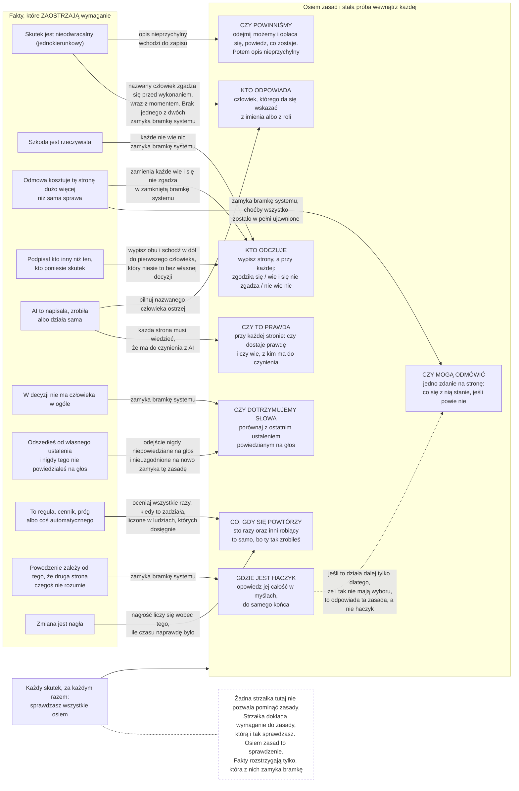
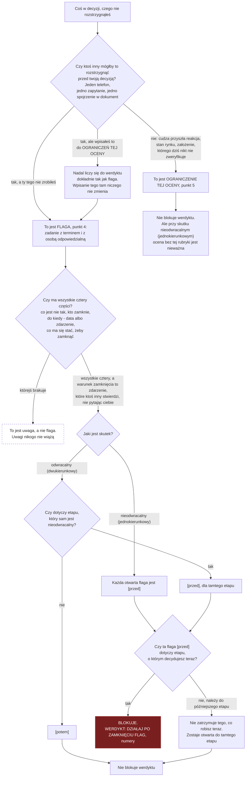
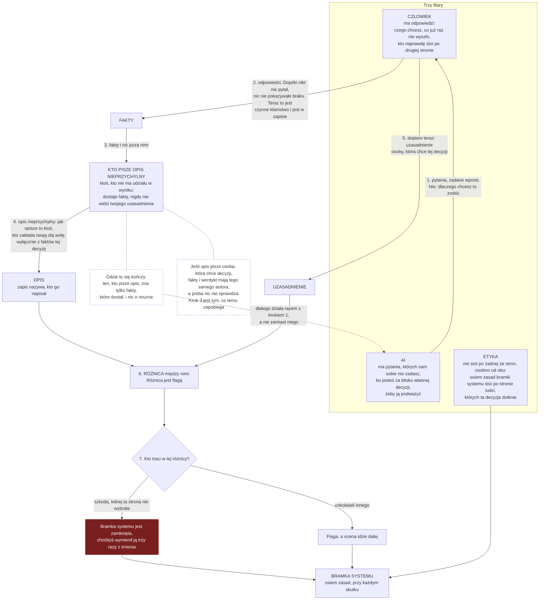

# MSS — diagramy

**Wersja 4.5.0.** Standard: [STANDARD.pl.md](../standard/STANDARD.pl.md) · English: [DIAGRAMS.md](DIAGRAMS.md)

Cztery diagramy procedury, którą standard opisuje słowami:

1. **Przebieg oceny** — od decyzji do zapisu.
2. **Osiem zasad** — i co sprawia, że każda z nich zamyka bramkę.
3. **Flaga czy ograniczenie** — do której rubryki coś trafia.
4. **Trzy filary** — kto co wnosi i w jakiej kolejności.

**Standard jest kanonem.** Te diagramy są pomocą w jego czytaniu. Wszędzie tam, gdzie diagram i standard się rozejdą, **wygrywa standard.**

Renderują się natywnie na GitHubie i są tekstem — więc możesz je wersjonować i poprawiać jak każdą inną linijkę standardu.

---

## 1. Przebieg oceny

Od decyzji do zapisu.

Kolejność: SKUTEK → BRAMKA SYSTEMU → PRZEGLĄD → FLAGI → KIEDY WRACASZ → WERDYKT → OGRANICZENIA TEJ OCENY.

```mermaid
flowchart TD
    D["Decyzja, którą masz zaraz wykonać"] --> SCOPE{"Czy kogoś dotknie?<br/>Nie pytanie o fakt,<br/>nie ruch, który cofniesz jednym gestem"}
    SCOPE -->|"nie, a skutek zostaje<br/>w tej rozmowie"| OUT["Nie uruchamiaj MSS.<br/>Nadgorliwość też jest błędem"]
    SCOPE -->|"nie, ale skutek wychodzi<br/>poza tę rozmowę, punkt 1c"| TIME
    SCOPE -->|"tak"| TIME{"Punkt 1b. Czy sama zwłoka<br/>jest skutkiem nieodwracalnym?"}

    TIME -->|"tak"| ACT["Działaj teraz"]
    ACT --> LATE["Potem zapisz, w ciągu doby.<br/>Zapis musi nazwać, dlaczego nie było czasu.<br/>To jedyne odstępstwo od kolejności"]
    LATE --> C1
    TIME -->|"nie"| C1

    C1{"Punkt 1. Czy zachodzi którykolwiek z czterech?<br/>1. nie da się cofnąć<br/>2. dużo kosztuje, gdy pójdzie źle<br/>3. wiąże cię wobec kogoś spoza firmy<br/>4. ocenia człowieka lub psuje relację<br/>w sposób, którego ta osoba nie odrzuci bez kosztu"}
    C1 -->|"żaden z czterech"| TWO["Skutek odwracalny (dwukierunkowy)"]
    C1 -->|"którykolwiek z nich<br/>albo masz wątpliwość"| ONE["Skutek nieodwracalny (jednokierunkowy)"]

    NOTE0["Nieodwracalny jest nazwą całej klasy,<br/>a nie samego warunku 1. Obejmuje wszystkie cztery,<br/>nie tylko techniczne cofnięcie, i jeden wystarczy.<br/>Wiążąca oferta, którą technicznie da się wycofać,<br/>jest nieodwracalna przez warunek 3"]
    C1 -.- NOTE0

    TWO --> C1C{"Punkt 1c. Którykolwiek z czterech?<br/>1. dotknie kogoś trzeciego i nie da się cofnąć<br/>2. powtórzy się bez ciebie<br/>3. wykona się bez ciebie<br/>4. ktoś prosił o pominięcie sprawdzenia"}
    C1C -->|"żaden z czterech"| SHORT["Krótki zapis jest dozwolony"]
    C1C -->|"którykolwiek z nich"| FULL["Wymagany zapis pełny"]
    ONE --> FULL

    SHORT --> GATE
    FULL --> GATE
    GATE{"Punkt 2. BRAMKA SYSTEMU.<br/>Wszystkie osiem zasad, przy każdym skutku.<br/>WOLNO albo NIE WOLNO. Trzeciej możliwości nie ma"}

    GATE -->|"NIE WOLNO"| NA["Nazwij zasadę i stronę, w którą uderza.<br/>Dopisz, co musiałoby się zmienić.<br/>Skutek nieodwracalny: opis nieprzychylny<br/>i kto go napisał"]
    NA --> STOP["WERDYKT: NIE DZIAŁAJ"]
    STOP --> DEAD["Zamkniętej bramki systemu nic nie odwraca.<br/>Ani dobry przegląd, ani to,<br/>że dotąd wszystko robiłeś dobrze"]

    GATE -->|"WOLNO"| GL["Napisz: sprawdzone wszystkie osiem.<br/>Pod spodem, zawsze: najbliższa zasada<br/>i zdanie o nazwanej stronie.<br/>Skutek nieodwracalny: opis nieprzychylny<br/>i kto go napisał"]
    GL --> REV["Punkt 3. PRZEGLĄD, pięć pytań.<br/>Skutek nieodwracalny: Skutki zawsze obowiązkowe,<br/>z kosztem cofnięcia i tym, kto go poniesie"]
    REV --> FL["Punkt 4. FLAGI. Flaga to zadanie z terminem<br/>i z osobą odpowiedzialną. Cztery części, numerowane.<br/>Rodzaj ustala skutek, a nie ty"]
    FL --> BACK["KIEDY WRACASZ DO SPRAWY:<br/>co musi się wydarzyć - ile czego i w jakim terminie.<br/>Pojedynczy krok, po co nie ma wracać: wiersz odpada"]
    BACK --> V{"Punkt 4. WERDYKT,<br/>odczytywany z trzech linii. Znikąd indziej"}

    V -->|"bramka systemu mówi NIE WOLNO - zawsze,<br/>niezależnie od reszty"| STOP
    V -->|"otwarta flaga [przed] dla tego etapu"| PAF["DZIAŁAJ PO ZAMKNIĘCIU FLAG, numery.<br/>Bez powodu: powód jest już we fladze"]
    V -->|"pozostałe przypadki"| PROC["DZIAŁAJ, z powodem"]

    STOP --> LIM
    PAF --> LIM
    PROC --> LIM
    LIM["Punkt 5. OGRANICZENIA TEJ OCENY, część obowiązkowa.<br/>Czego nie sprawdziłeś, czego nie wiesz,<br/>co założyłeś. Skutek nieodwracalny bez nich: nieważne"]

    LIM --> LCHK{"Czy cokolwiek, co tam wpisałeś,<br/>da się sprawdzić przed decyzją?"}
    LCHK -->|"tak - liczy się do werdyktu<br/>tak samo jak flaga"| V
    LCHK -->|"nie"| REC["Punkt 6. Zapisz, krótko albo pełno,<br/>jak rozstrzygnął punkt 1c. W krótkim zapisie<br/>werdykt pojawia się tylko przy NIE DZIAŁAJ"]

    NOTE1["Wolno, a mimo to nie warto, jest normalnym wynikiem.<br/>Zapisujesz to jako NIE DZIAŁAJ, z powodem,<br/>a każde NIE DZIAŁAJ niesie zdanie mówiące,<br/>co dokładnie musiałoby się zmienić"]
    V -.- NOTE1

    classDef stop fill:#7a1f1f,color:#ffffff,stroke:#c96a6a,stroke-width:1px
    classDef aside fill:none,stroke-dasharray:4 4
    class STOP,DEAD stop
    class NOTE0,NOTE1,OUT aside
```

**Diagram uwidacznia dwie reguły, które proza musi powtarzać dwa razy.**

**Nic późniejszego nie otwiera NIE WOLNO.** Żadna strzałka tam nie wraca, a reguła werdyktu wskazuje na to po raz drugi od dołu. Dobry przegląd tego nie cofnie.

**OGRANICZENIA TEJ OCENY działają odwrotnie.** Pisze się je na końcu, a mają strzałkę wracającą do werdyktu — bo wiersz o czymś, co dało się sprawdzić, a czego nie sprawdziłeś, liczy się dokładnie tak jak flaga. Ostatnia rubryka twojego własnego dokumentu potrafi zmienić werdykt trzy linijki wyżej.

---

## 2. Osiem zasad i co sprawia, że każda z nich zamyka bramkę

**Sprawdzasz wszystkie osiem, przy każdym skutku.**

Fakty po lewej nie wybierają, które zasady mają zastosowanie. One **zaostrzają wymaganie** przy zasadzie, którą i tak już sprawdzasz.

To odpowiada na pytanie, które ludzie faktycznie mają — **ile z tego dotyczy mojego przypadku** — a odpowiedź brzmi: wszystkie osiem dotyczy każdego przypadku.

Fakty po lewej zmieniają nie to, *które* zasady mają zastosowanie, tylko **która z nich zmienia się ze sprawdzenia w odmowę.** Każda strzałka dokłada wymaganie. Żadna go nie zdejmuje.

**Warto przeczytać uważnie trzy fakty, które sięgają po dwie zasady każdy.** Skutek nieodwracalny, odmowa kosztująca drugą stronę dużo więcej niż sama sprawa, oraz AI w robocie.

---

## 3. Flaga czy ograniczenie tej oceny

**Rozstrzyga jedno pytanie, a odpowiedź nie należy do ciebie.**

**W tym drzewie jest jedno prawdziwe pytanie** — da się sprawdzić przed decyzją czy nie. Wszystko po nim wynika już bez żadnego twojego osądu.

**Gałąź środkowa jest tu sednem.** Przeniesienie sprawdzalnej rzeczy do OGRANICZEŃ TEJ OCENY jej nie zmiękcza. Liczy się jak flaga niezależnie od tego, gdzie ją wpiszesz.

**Dolny wiersz jest tym, na co reagujesz:**

| Co masz | Co to robi |
|---------|-----------|
| flaga `[przed]` dla etapu, o którym decydujesz teraz | zatrzymuje werdykt |
| flaga `[przed]` dla późniejszego etapu | zostaje otwarta do tamtego etapu, teraz nic nie zatrzymuje |
| flaga `[potem]` | nigdy nie blokuje |
| prawdziwe ograniczenie tej oceny | nigdy nie blokuje |

---

## 4. Trzy filary i kto pisze opis nieprzychylny

Kto co wnosi i w jakiej kolejności.

**Kolejność jest tu mechanizmem, a nie sposobem prezentacji.**

**Numery na strzałkach są całym tym diagramem.**

Opis powstaje z faktów w **kroku 4**, zanim twoje uzasadnienie w ogóle pojawi się w rozmowie w **kroku 5**. Krytyk, który przeczytał twoją wersję, tylko ją powtórzy.

Przy pracy z AI kroki 3 i 4 razem to jedno zapytanie — i to właśnie czyni niezależnego autora w ogóle osiągalnym.

**Dwa przerywane pola mówią, gdzie to przestaje działać.** Ten, kto pisze opis, nie wie nic ponad to, co powiedziałeś. Dlatego niosą to kroki 1 i 2: pytanie jest tym, co zamienia przemilczenie w czynne kłamstwo, na które ktoś może później wskazać.
